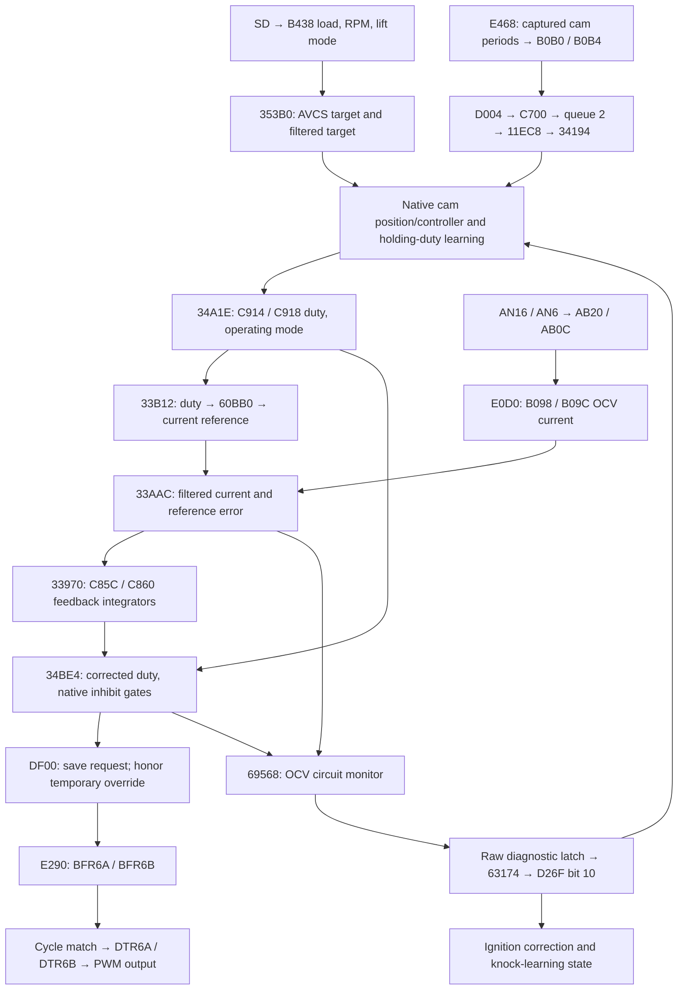

# AVCS output removed by the former rear-O2 bypass

[Process-flow audit](PATCH_PROCESS_FLOW.md) · [Exact repair bytes](evidence/avcs_ocv_repair_20260913.json) · [Native execution tests](../../tests/test_avcs_actuator_process_flow.py)

**Confirmed firmware defect, repaired in both rolling builds. The first vehicle
test shows current/output activity and Left reported cam advance, but the user
confirms the loaded cut persists.** See the [September 13 capture review](AVCS_REPAIR_CAPTURE_20260913.md)
for the separate Right-angle discrepancy and the limits of these observations.

The wideband component had misidentified an AVCS oil-control-valve (OCV)
feedback loop as rear-O2 processing. It bypassed the current converter and
five scheduled functions, including the normal hardware-output publisher.
The lean-cut component then reused the native controller's two float
integrators as integer state and replaced their unity initialization.

In the exact logged v2 image, the normal cam controller can calculate a
nonzero duty but the removed publication never writes it to the PWM buffers.
Executing native hardware initialization followed by the installed output
task leaves both buffers at zero. The unmodified stock publication writes
nonzero values for the same requested duty. This is a connected reproduction
of the missing command, independent of a physical cam-response model.

## Why the old identification was wrong

Three independent ROM connections establish ownership:

1. `34A1E` produces `C914/C918` from the AVCS controller and learned holding
   duty, with mode selection and limits. The removed `33B12` reads that pair.
2. Removed `34BE4` calls `DF00`, which calls `E290`. The latter writes
   **`FFFFF510/F512`, ATU-II BFR6A/B**, the two PWM buffer registers.
3. Removed `69568` reports records `86..89`; their native descriptors contain
   **P2093, P2092, P2089 and P2088**. The matching D2WD610H definitions identify
   these as the two OCV solenoid circuit open/short faults. Their switches at
   `5BDDA..5BDDD` stayed enabled, but the periodic monitor was bypassed.

The register identities and cycle transfer are documented in the
[Renesas hardware manual, sections 11.2.22–24 and 11.3.9](https://www.renesas.com/en/document/mah/sh-2e-sh7055s-hardware-manual).
This proves the software output channel. Harness continuity, solenoid current,
cam movement and torque are not supplied by these instruction tests.

The actual retained legacy oxygen-voltage workers use **`ABCC/ABD0`** and
`217B8/2212C`. They are a separate path. The earlier rear-O2 labels on
`E0D0/DFB4/33970/33AAC/33B12/34BE4/69568` are retracted, including the
September 8–9 central audit's narrower dependency approvals.

## Complete repaired handoff



| Stage | Producer, transformation and consumer |
|---|---|
| ADC current | The normal scan maps AN16 to `AB20` and AN6 to `AB0C`. `E0D0` copies these unsigned words to `B094/B096` and publishes `B098/B09C = max(0, counts * 5/65536 * 0.334 - 0.035)`, using `72848/7284C`. |
| Requested current | `33B12` maps duty `C914/C918` through the 0–100 axis of `60BB0`. It writes `C884/C888` and adds `7BFA4` to form references `C87C/C880`. |
| Measured current/error | `DFB4(bank)` returns `B098+4*bank`. `33AAC` filters the pair with `7BFA0` into `C86C/C870`, then writes reference-minus-measurement to `C874/C878`. |
| Current correction | `33964` initializes floats `C85C/C860` to **1.0**. `33970` updates them from the errors and `60B88/60B9C`, qualified by the previous output; `7BE34` selects unity reset. |
| Final duty | `34BE4` clamps `C85C*C914` and `C860*C918` to 0–100 into `C91C/C920`. Crank, stop/enable, diagnostic and AVCS-feature qualifications can instead publish zero. |
| Output publication | Under `3AF4/3B08` protection, `34BE4` divides duty by 100 and calls `DF00` for both banks. `DF00` saves normalized requests at `B0A0/B0A4` and calls `E290` unless the corresponding `B0AE/B0AF` override is active. |
| PWM conversion | `E290` converts normalized duty to Q16 and uses native `2390` with periods `AB8C/AB8E`; the unsigned words go to `BFR6A/F510` and `BFR6B/F512`. Its interrupt-mask section restores the caller mask. |
| Hardware startup | `DFE8` clears override-active bytes, initializes both periods from `72852` (**6666 counts**), sets initial BFR values to zero and starts the timer channels. Initial duty registers are subsequently replaced on a cycle match. |
| Override/recovery | `34DA0` selects native temporary actuation for modes 2/4. `DF1E` starts the per-bank sequence; `E174` progresses it. Normal `DF00` calls update the saved request during the override. `DF6E` or completion in `E174` restores that latest request. These functions were not removed by the old patch. |
| Circuit monitoring | `69568 → 69572/697B4` consumes the duty, measured current and references. Enabled open/short reports reach `50FF6 → 535C0`; healthy confirmation reaches `5108C → 55EC4`. Current status, raw latches and snapshot requests are distinct. |

The periodic parent `11270` calls cam qualification and target/controller
tasks first. Its tail then calls `34A1E`, `33B12`, `33AAC`, `33970`, and
`34BE4` in that order. The patch had replaced the last four task pointers
with `66C2`. The current converter and circuit-monitor bypasses were separate
edits, so repairing just one pointer would leave inconsistent feedback.

## Cam observations, learning and the periodic controller

The feedback input has its own event path. `E468` matches an engine event
against each bank's three synchronized identities at `C6A0/C6A3`. It uses
the period `AC08 >> 4`, captured timestamps `AC1C >> 4` and `B0C8/B0CA`,
valid flags `B0CC/B0CD`, direction configuration and the two offset maps
`60980/6098C`. It publishes raw angles `B0B0/B0B4`, bounded to 0–120.
An invalid capture publishes zero and clears its elapsed-count word.

The subsequent `D004 → C700` call posts **only the bank number**, using
descriptor `FCC8`: queue 2, one payload word, callback `11EC8`. Queue 2's
descriptor `FA1C` assigns RTOS task 3 and **30 records of 20 bytes** at
`FFFF94A0..96F7`. `11EC8` calls `34194`, which reads the latest raw angle
from shared RAM. The queued record does not contain an angle or timestamp.
The tests execute native enqueue, both callbacks and invalid captures with
an explicitly already-active queue. A forced full queue reproduces a dropped
callback while the raw angle still updates. It does **not** show that the
vehicle filled this queue, or measure activation/dispatch latency.

The native consumer task `C844` also runs through `6270` dequeue, both bank
callbacks and its `3F2C` completion call. It drains the queue into its own
20-byte scratch record at `AFB8`, with interrupt masking around dequeue and
the remaining-count snapshot. Its task descriptor `49CC` assigns priority 2,
the same as the SD/cut task. The test ends at the kernel-completion call;
activation, preemption and elapsed-time bounds are not supplied by that test.

`34194` selects a 13-pointer descriptor at `4C618 + 52*bank` and runs three
stages. `34208` adds a coolant-dependent offset, clamps and filters the raw
angle into `C8B0/B4` and `C8B8/BC`. `34304` subtracts the protected learned
offsets `8264/826C` to produce actual cam angles **`C8C8/C8CC`**, with a
zero lower bound. `3438E` computes target-minus-actual errors `C8E8/C8EC`.
Filtered errors and RPM-scaled derivatives occupy the remaining descriptor
fields through `C904` and feed the controller. The intermediate `C8B0/B4`
channels are not the final actual-angle channels.

Initialization `344A8` writes both protected offsets as 40 and sets the low
permission bits of `8274` to 2. In the native rest-learning state, `3475C`
qualifies stable observations; `345F4` adjusts offsets through protected
record writer `49530`; `34880` checks convergence; `34920` grants permission
value 1. The explicit stable-rest fixture reaches qualification on call 64
and permission on call 127. Native `4963A` accepts both resulting protected
records. These are invocation counts, not seconds.

The controller suite executes these **21 consecutive entries** from the
native `11270` task, through pointers `11444..11494`:

```text
34BAC 34D50 34D6A 33B92 34CD2 353B0 3475C
345F4 34880 34920 34F40 35BE8 35A3C 35CAA
35B34 35750 34A1E 33B12 33AAC 33970 34BE4
```

This includes operating-state selection, target lookup, learning permission,
oil/RPM qualification, primary and additional position feedback, holding-duty
learning, final duty selection, current feedback and PWM output. Native
`34F40` supplies the controller-enable bit; it is no longer forced in this
connected test. Both permission states produce their expected native modes
(5 with permission, 6 without). Other subsystems in parent `11270`, real task
interleavings and the engine's hydraulic response remain separate boundaries.

The temporary-output test also runs `E174` to completion for both banks:
the installed 95% and 9.36% phases alternate, complete five repetitions,
clear override flags and restore each bank's latest normal request. Normal
publication during the override updates that saved request without replacing
the temporary output early.

## Fault feedback and reset dependencies

The restored open and short monitors qualify for 126 eligible invocations
in the supplied electrical-fault fixtures. They preserve native interrupt
masking and byte/complement integrity while reporting the four enabled OCV
codes. Healthy confirmation clears the **protected current-status** bits
after its own qualification period. Readiness or AVCS-feature loss resets
the monitor counters.

There is a second, latched state. `535C0` also sets the raw status bank at
`DAB6`; `55EC4` does **not** clear that bank. `63174`, at `644A6..64578`,
reads these raw bits to publish **`D26F/10`**:

| Descriptor ID | Fault | Raw status byte/mask |
|---|---|---|
| `89`, `88` | P2088, P2089 | `DAE5`, `80` / `40` |
| `87`, `86` | P2092, P2093 | `DAE5`, `20` / `10` |
| `84`, `83` | P0340, P0345 | `DAE4`, `10` / `08` |

The aggregation requires diagnostic mode getter `470F4` to be nonzero or
`DAA4 == 1`. Clearing that gate clears the published fallback bit while the
raw latch remains. `651A6` returns 2 when `D26F/10` is set. It feeds AVCS
duty fallback, clears learning convergence, and revokes permission at `8274`.
It also feeds the `496C8` ignition correction and `3DA30/3DA60/3DF56` knock
state routines. This is not the separate MAF-status getter `65168`.

Native `5339C` can clear these raw latches using the reset metadata in each
20-byte diagnostic descriptor. Parent `564B0` calls it when diagnostic mode
`8FA0` differs from its prior value `DC08`. Tests execute the reset helper
and the resulting fallback update; the mode transition itself is an explicit
fixture boundary. Clearing the latch does not fabricate successful cam-rest
learning: permission remains at 2 until native qualification grants it again.

`3DF56` can reset the 64 protected knock-learning records on a fallback
transition from 2 to 0, or while fallback is 2 and `B51D/40` is clear, with
the AVCS feature enabled. Its bounded writes end at `851B`, immediately
before **IAM at `851C`**. The connected entry-to-fault test verifies both
running-flag states and leaves IAM unchanged. The actual loaded capture
contains neither these diagnostic latches nor cam-control permission.

A separate `63174` branch uses **current**, rather than raw-latched,
P0011/P0021/P0345/P0340 status to set `D270/80`. Through `1A202` it selects
the secondary spark slots in `C290`; healthy current status returns to the
normal six primary slots even if raw history persists. The connected
[ignition scheduler and timer trace](PATCH_PROCESS_FLOW.md#ignition-timing-permissions-and-the-coil-timer-state-machine)
checks this path through all six outputs. This distinction does not establish
that either fault state was present in the car.

## Repair and RAM ownership

The shared components now preserve the stock `E0D0` entry and task pointers
`11488/1148C/11490/11494/114A0`. Build guards reject modifications to the
native current, integrator and output paths. The startup wrapper at `7EBA0`
now calls **`33964` first**, then zeroes its independent lean state.

| Patch field | Old, incorrect ownership | Repaired allocation | Native ownership checked |
|---|---|---|---|
| WB logger bank 1/2 | `B098/B09C`, required OCV-current feedback | `AE8C/AE90`, two floats | Old front-A/F raw-current pair, used by replaced `B690`; retained `B49A` initializes both to zero before runtime. |
| Lean counter | `C85C`, required AVCS float integrator | `AE9C`, u16 in a reserved four-byte slot | First element of the intermediate pair owned by bypassed front-impedance processor `B8CC`. |
| Lean state | `C860`, required AVCS float integrator | `AEA0`, u8 in a reserved four-byte slot | Second element of the same `B8CC` pair. |

`B8CC` is reached through `B658`, whose task pointer `6A6C` already points to
`66C2` in the external-wideband architecture. The active special-ADC routines
`BAE0/BCB4` use neighboring `AE84/AE88`, `AEC0/AEC4` and flags, rather than
these relocated fields. Tests execute both banks' complete ADC handoff with
sentinels across all four new slots. Native `B49A` initialization also runs
with nonzero lean-state sentinels and leaves those two slots untouched.

The build verifies the retired front-owner entry points and code identities
before reusing this storage. Normal startup DMA also covers all four slots.
Restoring the front producer in a future architecture requires revisiting
this ownership contract.

The older standalone single-front-A/F and combined builders had the same
misidentification. They now preserve the native converter, five task pointers
and initializer too. Their verifiers check those byte ranges independently;
temporary builds pass. No additional standalone or candidate BIN is published.

The zero-invalid WB sentinel, readiness values, lean policy, MAP scaling,
VE, timing, transient coefficients and **0.06 load filter** are unchanged.
No dashpot change is part of this repair. The new startup wrapper occupies
`7EBA0..7EBC3` (36 bytes, formerly 24), entirely within its existing space;
it uses a four-byte saved PR while invoking the native initializer.

Logger parameters **E500, E504 and E505** retain their IDs, display conversions
and profile selections but now read `FFAE8C`, `FFAEA0` and `FFAE9C`.
Both the complete logger definition and fragment are updated. Use those
definitions with the repaired images: old definitions would read OCV state.
Existing CSV captures retain their original meanings and are never remapped.

## Exact image and verification scope

| Rolling artifact | Repaired SHA-256 | Subaru checksum |
|---|---|---|
| `master_patch/D2WD610H_master_patch.bin` | `3e95b7508427f544e30a96c7aa78298b32560a6f3caf5c180e7949b8c2adc388` | `1ADC9F24` |
| `master_patch_v2/D2WD610H_master_patch_v2.bin` | `fabceb54359aca76e6e15835a51aa5cfd008e570dc002e886eaa62a6cb020ce5` | `AA416B03` |

Each image differs by **72 bytes in 16 spans** from its immediately preceding
rolling image, including checksum. The evidence file records every before/after
byte and both hashes. Capture reconstruction reverses those exact edits and
the earlier pump edit, still requiring the loaded image's original
`fd795813…` hash. It never substitutes today's ROM for the logged one.

The native actuator suite covers the missing-output reproduction, converter
and feedback flow, native-plus-lean initialization, SD/target/duty/output
connection across both lift maps and 2500–4144 RPM, inhibit recovery,
override handoff, and relocated RAM isolation. A negative control restoring
only the output pointer still yields zero PWM because the old initializer
leaves both AVCS integrators at zero. Main and v2 build verification also pass.

Six suites now cover this subsystem: four target groups, eight actuator
groups, three controller groups, six diagnostic groups and four cam-event
groups, plus four cam-performance qualification/recovery groups. The shared
timer follow-up also executes AVLS initialization and periodic/transition
updates, checking that AVCS and AVLS preserve each other's channels.
Each records explicit fixture boundaries in its module. The
[consolidated run](evidence/process_flow_tests_20260912.json) includes their
results with the exact current and captured image identities.

These checks establish a real software repair. They do not reproduce physical
cam angles, oil control, combustion or the observed torque collapse. Actual
cam angles and OCV outputs were absent from the loaded capture. The broader
process-flow audit remains open; the earlier claim that the complete AVCS
path had been preserved was wrong.
