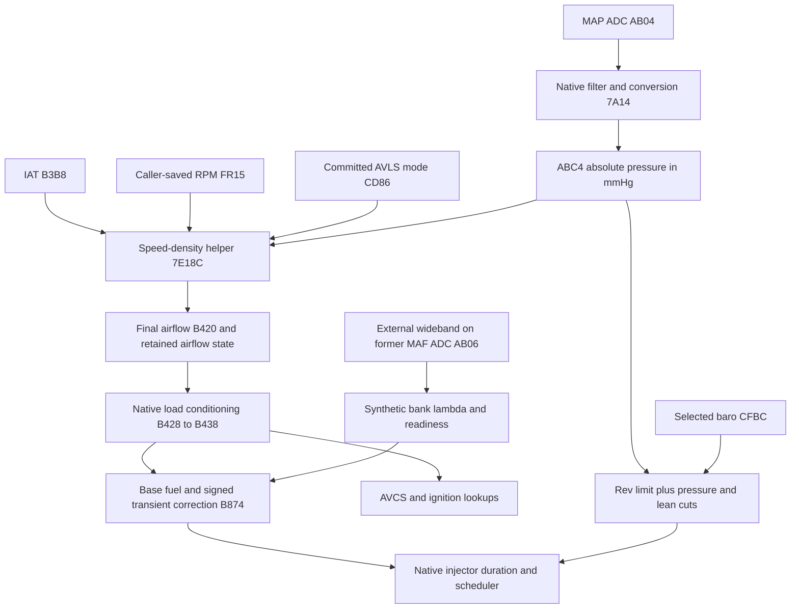

# D2WD610H project reference

This is the starting point for the EZ30R speed-density project. It joins the
patch's history, current architecture, address evidence and unresolved issues.
The September 8–9 audit uses the stock Ghidra program through MCP, the saved
stock/main/v2 images, their builders and the offline instruction fixtures.

**The near-stall is still unresolved.** Passing the build and execution checks
establishes the tested software contracts, not a vehicle-validated calibration.
See [findings](FINDINGS.md) before relying on an older address label.

| Read | Covers |
|---|---|
| [Patch story and operation](PATCH_STORY.md) | Why the patch exists, how the pieces interact, and the investigation's history. |
| [Images and calibration](IMAGES.md) | Exact stock/main/v2 identities, differences, ownership and build commands. |
| [Memory and hardware](MEMORY_AND_IO.md) | Correct RAM range, timer descriptors, fan/purge paths and checksum boundaries. |
| [Signals and routines](SIGNALS.md) | Types, units, producers, consumers and sensor sources. |
| [Methods](METHODS.md) | Lookup descriptors, SH-2E arithmetic, literal decoding, scheduling and test limits. |
| [Logger and captures](LOGGER.md) | Parameter meanings, profile budgets and historical log provenance. |
| [Findings and open evidence](FINDINGS.md) | Corrections, conditional defects and missing evidence. |
| [Complete address index](ADDRESS_INDEX.md) | Inventoried address candidates, source claims, checks and review status. |
| [Ghidra updates](GHIDRA.md) | MCP changes, readback verification and server limitations. |
| [Document retirement register](DOCUMENT_REGISTER.md) | Replacements to review before old documents are removed. |
| [Audit status](AUDIT_STATUS.md) | Scope, verification and remaining limits. |

## The runtime path

SD does not use processed MAP `B2A0`. That signal feeds other retained
consumers and the stock barometric estimate. The diagram shows major
dependencies, not the complete scheduler order.

Use full addresses and specify the image when recording a discovery. Include
access width, units, producer/consumer and evidence limits. A historical label,
plausible physical explanation or no-xref result is not a verified fact.
The [evidence directory](evidence/) retains the machine-readable audit.

Shared components are in [patches](../../patches/README.md); offline checks are
in [tests](../../tests/README.md). V2 retains its layout and behavior; only
component references changed. The K-line adapter and the user's independent
dashpot experiment were preserved.
