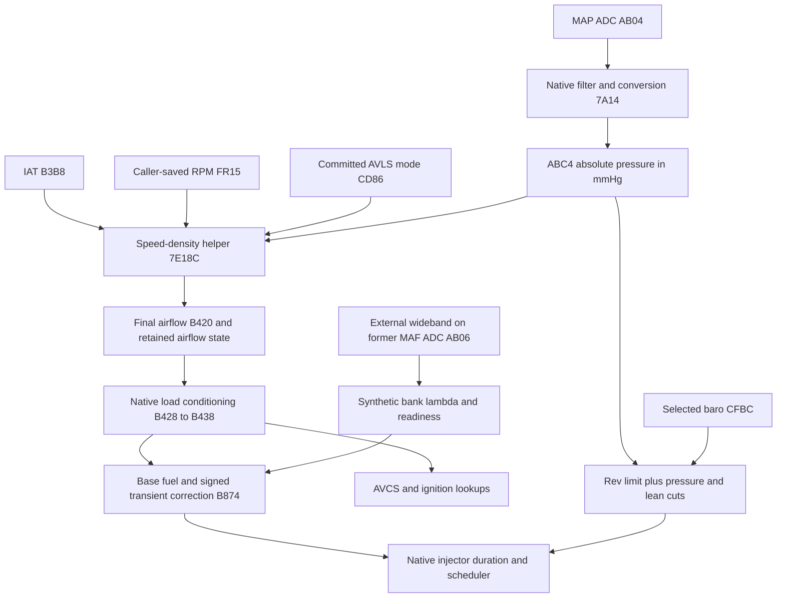

# D2WD610H project reference

This is the starting point for the EZ30R speed-density project. It joins the
patch's history, current architecture, address evidence and unresolved issues.
The September 8–9 audit uses the stock Ghidra program through MCP, the saved
stock/main/v2 images, their builders and the offline instruction fixtures.

**The loaded cut is not yet proven cured.** The full-flow audit found and repaired
a separate, definite failure of the native AVCS feedback/PWM path; both rolling
BINs and the logger definition now contain that correction. Passing the build and execution checks
establishes the tested software contracts, not a vehicle-validated calibration.
See [findings](FINDINGS.md) before relying on an older address label.

| Read | Covers |
|---|---|
| [Full patch process-flow review](PATCH_PROCESS_FLOW.md) | Ongoing dependency audit beyond the earlier address review: every build assignment, producers, consumers, initialization, latches and scheduling. |
| [AVCS actuator dependency repair](AVCS_OCV_REPAIR_20260913.md) | Corrects the false rear-O2 identity, restores current feedback and PWM, and moves patch RAM out of the cam controller. |
| [Patch story and operation](PATCH_STORY.md) | Why the patch exists, how the pieces interact, and the investigation's history. |
| [Images and calibration](IMAGES.md) | Exact stock/main/v2 identities, differences, ownership and build commands. |
| [V2 load-fallback repair](V2_LOAD_FALLBACK_FIX.md) | Local bypass added to v2 while preserving its timing, MAP tip-in and other calibrations. |
| [September 12 AVLS/misfire review](V2_AVLS_MISFIRE_20260912.md) | Repeated disturbance after high-lift selection, captured-image verification and a separate corrected lean-cut release defect. |
| [Neutral AVLS captures and fueling adjustment](V2_AVLS_NEUTRAL_20260912.md) | Oil-gate repair, stationary changeover evidence, warm rich/lean fueling observations and the requested v2 idle/high-lift VE correction. |
| [Injector and pump-demand scaling](FUEL_PUMP_SCALING_20260912.md) | Separate consumption coefficient corrected for larger injectors; native pump replay and the limits of its relationship to the rich bog. |
| [Fuel learning and open-loop application](AF_LEARNING_WOT_ISOLATION.md) | Corrects the unsupported 500 g/s isolation claim; native tests show retained trim still reaches OL fuel. |
| [Memory and hardware](MEMORY_AND_IO.md) | Correct RAM range, timer descriptors, fan/purge paths and checksum boundaries. |
| [Signals and routines](SIGNALS.md) | Types, units, producers, consumers and sensor sources. |
| [Methods](METHODS.md) | Lookup descriptors, SH-2E arithmetic, literal decoding, scheduling and test limits. |
| [Logger and captures](LOGGER.md) | Parameter meanings, profile budgets and historical log provenance. |
| [Findings and open evidence](FINDINGS.md) | Corrections, conditional defects and missing evidence. |
| [Complete address index](ADDRESS_INDEX.md) | Inventoried address candidates, source claims, checks and review status. |
| [Ghidra updates](GHIDRA.md) | MCP changes, readback verification and server limitations. |
| [Document disposition register](DOCUMENT_REGISTER.md) | Completed cleanup: original documents, archive locations and retained specialist references. |
| [Audit status](AUDIT_STATUS.md) | Scope, verification and remaining limits. |
| [Repository cleanup](REPOSITORY_CLEANUP.md) | Post-audit file moves, preserved artifacts and verification. |
| [Denso scaling and FPU math](DENSO_SCALING_AND_FPU_MATH.md) | SH-2E FPU latencies, fixed-point integer tricks, RomRaider helper floats, and wideband ADC execution audit. |
| [Turbo Table Sanity Check](TURBO_TABLE_SANITY_CHECK.md) | Exhaustive 146-table sanity audit calibrated against proven forced-induction standards (10.7:1 CR, 5 psi spring, 98 RON). |

## The runtime path

SD does not use processed MAP `B2A0`. That signal feeds other retained
consumers and the stock barometric estimate. The diagram shows major
dependencies, not the complete scheduler order.

Use full addresses and specify the image when recording a discovery. Include
access width, units, producer/consumer and evidence limits. A historical label,
plausible physical explanation or no-xref result is not a verified fact.
The [evidence directory](evidence/) retains the machine-readable audit.

Shared components are in [patches](../../patches/README.md); offline checks are
in [tests](../../tests/README.md), and capture/replay tools are in
[tools/analysis](../../tools/analysis/README.md). Superseded investigations are
in the [archive](../archive/README.md). The audit index reproduces the source
text at its reviewed Git revision and maps links to these current locations.

The [image comparison](IMAGES.md) records v1/v2 calibration differences and the
[September 9 v2 repair](V2_LOAD_FALLBACK_FIX.md), which carries main's local
load-fallback bypass into v2 while preserving its timing/tip-in corrections.
The earlier cleanup changed no runtime source, calibration or ROM. Historical
audit results remain tied to their reviewed images as later repairs are added.
