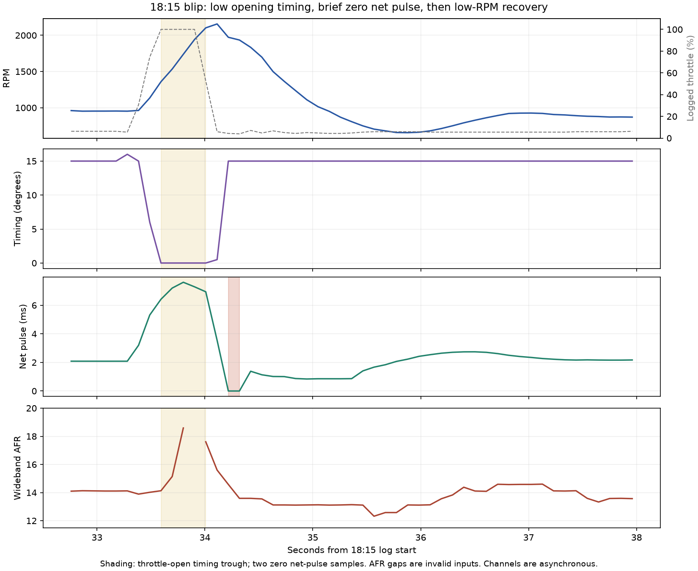

# September 8 evening — opening timing, tip-in fuel and recovery

**MAP-source correction:** all MAP figures below are processed E51/B2A0.
The SD input ABC4 and MAP/airflow fallback flags were not captured. Comparisons
that feed these MAP samples into SD are proxy fixtures; see the subsequent
[source audit](../docs/archive/master_patch/MAP_SOURCE_AUDIT.md). Native tip-in itself uses
B2A0, so its pressure-source identification remains unchanged.

The user confirms sluggish pickup predates the dashpot experiment. Further
dashpot changes did not help; larger blips worsen recovery, and small throttle
movements can leave prolonged rough low RPM. The captures show separate
opening and closing problems. No finished repair is established.

## Capture and BIN identity

| Capture | Samples | Duration | Coolant | Finding |
|---|---:|---:|---:|---|
| `romraiderlog_20260908_180131.csv` | 1,112 | 123.730 s | 23→32°C | Five blips; 2° timing floor; lowest RPM 816 |
| `romraiderlog_dashpot2_20260908_181118.csv` | 1,813 | 222.598 s | 33→46°C | Start and idle; no throttle above 15%; lowest RPM after 10 s is 858 |
| `romraiderlog_dashpot3_20260908_181505.csv` | 498 | 51.684 s | 46→49°C | Five blips; 0° opening timing; recovery minima 655–684 RPM |

These are 22-channel captures, normally 104 ms apart. The first has an 8.265-s
gap; the second has 17.840-s and 16.488-s gaps. No samples were invented across
them. The third has no large gaps. Different cold temperatures and throttle
inputs prevent a controlled attribution of differences to dashpot changes.

The first version of the user's reused
`master_patch/candidates/D2WD610H_slight_dashpot_candidate.bin` had SHA-256
`7590b6ce79b41caea9d8bb850a31c41318708687120e45a584ad5030c1c47b8f`,
checksum `0D556987`, marker `26090802`. All 16 block CRCs match the recorded
18:00 post-flash verification, ending in `926036A9`. The user confirmed the
18:01 capture used this dashpot BIN.

The file was subsequently edited to SHA-256
`2f80b8e5cb80361cdee170655bc26aa8ed8a41bcf4cd7f7249fe3f8c8eaa1f1c`,
checksum `0807644D`, marker `26090803`. It changes 28 bytes from the first
version: the first two throttle-request columns in six 1000–2000-RPM rows,
checksum and marker. The 18:18 recorded verification matches all 16 blocks,
ending in `9E4FBB6C`. The 18:17 pre-flash comparison still read `926036A9`
from the ECU. **All three captures above precede that later flash**; their
names must not be used to assign them to the later BIN.

[The analyzer](../tools/analysis/analyze_20260908_dashpot.py) reconstructs both
historical images in memory, verifies their SHA-256 identities, and compares
FastECU's custom CRC for every block. It does not rewrite the user's file.
Both versions retain the earlier firmware, timing, tip-in, transient-fuel and
actual deceleration-air settings. Full capture hashes and numerical results
are in [the JSON report](20260908_dashpot_review.json).

## Opening and closing evidence

At 94.607 s in 18:01: 1363 RPM, throttle 100%, MAP 94.92 kPa, barometric
pressure about 94.92 kPa, load 1.25 g/rev, timing 2°. The throttle does reach
a large opening. Pedal is absent, so pedal-to-plate delay cannot be measured.

The 18:15 capture repeats this at a higher coolant temperature:

| Seconds | RPM | Throttle | MAP, kPa absolute | Timing | Net pulse, ms | AFR |
|---:|---:|---:|---:|---:|---:|---:|
| 33.385 | 962 | 30.59% | 91.35 | 15° | 3.197 | 13.89 |
| 33.593 | 1359 | 100% | 94.76 | 0° | 6.421 | 14.13 |
| 33.800 | 1738 | 100% | 94.92 | 0° | 7.609 | 18.59 |
| 34.113 | 2157 | 5.88% | 51.96 | 0.5° | 3.551 | 15.60 |
| 34.217 | 1973 | 4.31% | 34.17 | 15° | 0.000 | 14.58 |
| 34.320 | 1935 | 3.92% | 25.83 | 15° | 0.000 | 13.59 |
| 35.880 | 655 | 5.88% | 41.87 | 15° | 2.230 | 13.12 |

The zero net-pulse samples accompany short total pulses 0.51/0.77 ms, near
the approximately 0.65-ms latency. They warrant tracing the cut/zero-duration
source, but do not identify its reason. Retained overrun and other inhibit
states were not logged. Other blips reach the 0.600-ms net floor for several
samples without those zeros.

Timing is back at 15° at all five recovery minima. Low opening timing can
contribute to sluggish pickup but does not alone explain the later low-RPM
state. Previously measured B874 fuel reduction and idle-air response remain
relevant. B874's slow history settles more slowly in seconds at low RPM;
it was **not measured in these evening profiles**.

AFR at the RPM minima is around 12.6–13.1; lean indications occur earlier.
Exhaust transport, possible incomplete combustion and asynchronous sampling
prevent assigning instantaneous cylinder mixture from these rows. AFR zero
means invalid input. The 32.623-ms net pulse at 82.128 s in 18:01, and
8.191-ms sample immediately after the second 18:11 gap, disagree substantially
with total pulse and are flagged as data-quality outliers. Torn/stale reads
are possible, not proven physical pulse events.

## Native timing path

Six new groups in `test_opening_timing_execution.py` execute all five base
producers called by `28166`, the cam-tracking ratio and six map blends,
idle/base selection, final limits at `2777C`, and the six-cylinder composer
at `279CC`. Tables, actual/target cams, mode history, idle target and other
correction terms remain explicit fixture boundaries.

The normal tested final-minimum branch takes the greater of RPM table `5FB78`
and coolant table `5FB8C`. The coolant minimum is 2.1484375° below 30°C,
1.09375° at 35°C, and 0.0390625° at 40–60°C. This accounts for a 2° versus
0° logged floor without a dashpot/timing calibration change. The base selector
has a separate `5FC18` coolant floor.

The first low-RPM opening drop can occur with the original stock maps. Current
2000-RPM boost timing caps also influence interpolation below 2000 RPM. At
2014 RPM / 1.35 g/rev, stock A/D endpoints are about 10.76°/3.05°, versus
0.35°/0.35° currently. The actual cam-tracking ratio and other corrections
were not captured: conditional endpoint differences are not measured added
retard. No blind advance or global AVCS change was applied.

## Tip-in compensation: a concrete additional lead

Both main tip-in tables and the minimum calculated-pulse threshold were
already reduced to approximately 49% of stock for the larger injectors.
Throttle-change threshold `763DC` (1.466 in native throttle units), count
limit 20, reset periods 30 routine calls, and cumulative-throttle limit 44.82
remain stock. No broken enable flag has been demonstrated.

Native `14D1E` forms `B2CC` from retained throttle `B2C8` minus the sample two
throttle updates earlier. `23BAE` checks the delta, ignition-idle flag,
B748/80, CCBB/04, application count and accumulated delta. It calculates a
**separate supplemental pulse**, distinct from B874's contribution to regular
injection. E55/BEF0 can retain a stale last value; BF09/80 indicates the
request made on that invocation. Tests confirm history resets on negative
delta and after the retained elapsed-count threshold.

At `23D34..23D42`, the pressure-compensation input is **barometric pressure
CFBC minus retained MAP B2A0**. Unchanged table `5F470`, data `76AC8`, has
multipliers 0 at 151.4 mmHg vacuum, 0.5 at 229.5 and 1 at 307.6, staying 1
at greater vacuum. At lower vacuum, including atmospheric pressure and boost,
the lookup clamps to the **zero** first cell. The editor displays these as
−100%, −50%, 0% compensation and negative gauge pressures; −100% removes
the added fuel.

Seven groups in `test_tip_in_execution.py` demonstrate, with delta 20,
1350 RPM, 45°C, 712-mmHg barometric pressure and otherwise eligible inputs:

| Retained MAP | Supplemental request |
|---|---:|
| 330 mmHg / 44.00 kPa | 1.578 ms net |
| 482.5 mmHg / 64.33 kPa | 0.789 ms net |
| 650 mmHg / 86.66 kPa | None: pressure multiplier zero |
| 712 mmHg / 94.92 kPa | None: pressure multiplier zero |

Doubling A/B pulse tables in memory still gives zero near atmospheric pressure.
Making the first pressure cells neutral in another memory-only fixture restores
the request. **That sensitivity is not a recommended calibration or a written
candidate.** Tip-in can occur before MAP rises; 104-ms captures do not resolve
its short trigger window. This identifies a plausible missing contribution,
not proof that every blip missed its pulse or that this is the sole cause.

The request writes BEFC/BF10 and dispatches C700 family 0, slot 4. Its descriptor
routes one float to `11EF4 -> 2689C`; local disassembly shows a six-cylinder
loop calling `268E8`. Event delivery and injector actuation are not executed
by the new fixture. Their inhibit/timing interaction remains a next tracing
task alongside the zero-duration event.

The minimum-pulse editor scaling was also wrong: float `763E0` is compared
directly with the already-scaled pulse in microseconds. Its display must be
`x*.001` ms, whereas uint16 A/B cells correctly use `x*.004` ms. The master
generator/XML now display the existing threshold as **0.186 ms**, not 0.744 ms.
Only the display was corrected; no threshold bytes changed.

## Status

All thirteen new timing/tip-in groups pass on the baseline, idle-recovery
candidate and both reconstructed user dashpot versions. They are integrated
into the full master verifier, which passes. Existing ROMs, raw captures and
logger definition/profiles were not rewritten. No new flashable repair,
ECU connection or engine operation resulted. Further rev tests remain paused.

The next useful evidence must distinguish tip-in delta/request/last pulse,
cam tracking/base timing, and the source of zero scheduled pulse. Current
evening profiles lack those states. No flag bypass is justified by these tests.
