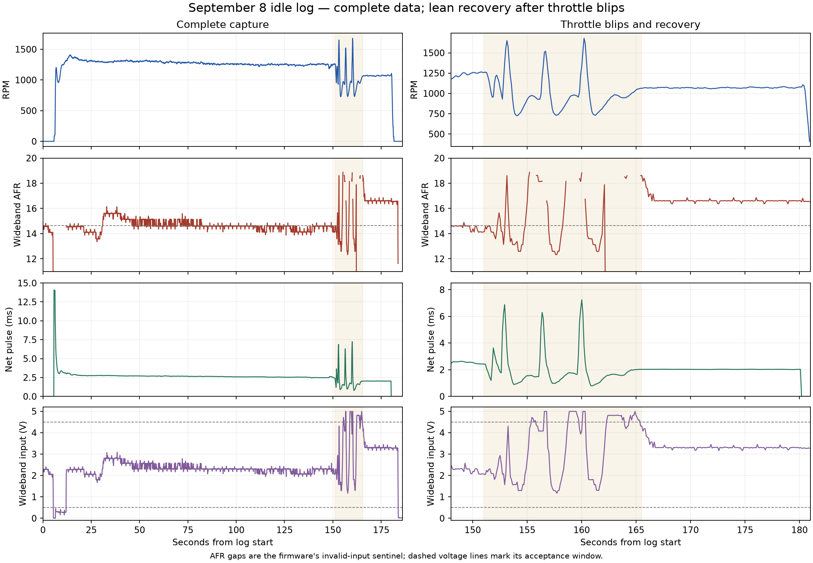

# September 8, 12:36 idle and throttle-blip capture

The logger repair is confirmed for the complete idle profile. The engine
calibration still needs work: throttle blips are followed by near-stall RPM
and a sustained lean indication at the lower recovered idle speed. No new
ROM or calibration was generated from this capture.

Source: `romraiderlog_idle_diagnostic_20260908_123651.csv`. The user reports
the latest 10:30 BIN, several revs at the end, a tendency to stall, and the
physical gauge following RomRaider. The on-disk BIN was written at 10:30:49
and has SHA-256
`48d63cf3b7085afc672dd809cf08f4aef2b1aaae8a880f421e656467b7aaf8f0`.
Independently recomputing FastECU's custom CRC32 (polynomial `0x5AA5A55A`)
for all 16 blocks matches every final ECU CRC recorded at 11:58:47--11:58:51
in `log_fastecu_2026-09-08_11h52m02s.txt`. This supports the reported image
identity; it is not a fresh ECU read performed during this analysis.



## Data completeness

- 1,786 samples, 22 channels plus time, 185.698 seconds.
- Every row has all 23 finite numeric fields; no empty/missing cells.
- Sample spacing: 101--108 ms, median 104 ms; no long gaps in this CSV.
- The restarted RomRaider sends the full 136-byte / 43-address request at
  12:36:37. The subsequent serial excerpt contains 2,295 complete 49-byte
  replies, all with valid checksums. Initial connection retries and the later
  loss of replies fall outside this CSV's recording interval.
- All four ordinary bank-trim channels remain zero. These are returned
  values, not missing data. CL/OL status remains 7, defined as open loop due
  to insufficient coolant temperature. Coolant spans 21--38 C.

The earlier 120702 and 121839 files contain only headings. They cannot be
used as engine traces. The native 43-address limit and RomRaider subscription
fix are documented in [the logger audit](../master_patch/LOGGER_CONNECTION_AUDIT.md).

## What the engine trace shows

Times are seconds from recording start. These are window medians, not a
single instantaneous ECU snapshot.

| Window | RPM | AFR | MAP, kPa absolute | Load, g/rev | Net pulse, ms | Latency, ms | Pump command |
|---|---:|---:|---:|---:|---:|---:|---:|
| 12--30 s | 1318 | 14.35 | 46.88 | 0.82 | 2.768 | 0.627 | 100% |
| 30--40 s | 1296 | 15.61 | 47.11 | 0.82 | 2.754 | 0.629 | 100% |
| 80--130 s | 1255 | 14.60 | 45.37 | 0.78 | 2.586 | 0.638 | 33.33% |
| 135--150 s, before blips | 1252 | 14.59 | 44.02 | 0.75 | 2.489 | 0.643 | 33.33% |
| 166--180 s, after blips | 1069 | 16.61 | 41.32 | 0.61 | 2.027 | 0.641 | 33.33% |

RPM first becomes nonzero at 5.821 s. The engine runs through the previous
30-second failure window and later spends a substantial interval near
14.6 AFR. It has not reproduced the earlier steadily worsening cold-idle
lean-out in the same form. That does not validate the tune over other speeds,
temperatures or loads.

The throttle-blip region begins around 151 s. RPM repeatedly drops into the
730s, with a minimum of 726 RPM in the selected 151--165.5 s interval. It
then recovers to approximately 1070 RPM but remains near 16.6 AFR through
180 s. Recorded RPM reaches zero near the end; the log alone does not
distinguish a stall from the operator shutting down.

## Leading calibration issue: correction tapers below 1200 RPM

The current low-lift table applies the full added idle correction at its
1200/1600-RPM rows but only a quarter of that addition at 800 RPM, tapering
to none at 500 RPM. This is a significant slope inside the speed range the
engine crosses when recovering from the blips.

Reading and interpolating the actual BIN at a fixed **41.32 kPa absolute**:

| RPM | Modeled low-lift VE |
|---:|---:|
| 1252 | 0.973 |
| 1200 | 0.962 |
| 1069 | 0.860 |
| 950 | 0.768 |
| 800 | 0.651 |
| 734 | 0.624 |

From 1252 to 1069 RPM, modeled VE drops **11.5% at the same pressure**. With
unchanged physical VE and other fuel effects, the inverse ratio would raise
AFR by about 13.0%, taking 14.59 to about 16.49. The observed later median is
16.61. That is a strong size/direction match, not proof that actual engine VE
is constant or that this is the sole fault. At the two windows' different
measured MAP values, the table gives approximately 0.986 and 0.860.

The before/after median net-pulse-to-logged-load ratio is approximately
3.312 versus 3.321 ms per g/rev. Latency is almost unchanged, as are the pump
command and charging voltage. Thus the sustained later pulse reduction
tracks the lower modeled load; the capture does not show a new large steady
fuel-multiplier loss after the blips. Neither pump command nor pulse command
measures physical pressure or delivered fuel.

Replaying the saved BIN's SD wrapper at ten recorded input points produces
airflow consistent with the log in the steady windows. Examples: at 169.994 s,
10.96 g/s replayed versus 10.85 logged; at 174.988 s, 10.97 versus 10.99.
The replay assumes low-lift state; E503 is absent from this capture. It
executes wrapper opcodes with modeled lookup helpers, not the entire ECU.
The RPM/pressure/input columns have different update times, particularly
during a blip, so exact row-by-row equality is not expected.

## Transient pulse reduction remains unresolved

The low-RPM VE slope is not a complete explanation of the transient itself.
For example, at 160.950 s the log has 774 RPM, approximately 5.77 g/s and a
0.7883-ms net pulse. Normalizing by airflow/RPM gives about 1.76 ms per g/rev,
well below the roughly 3.3 seen in the stable windows. The drop is also
present when normalized by the logged conditioned load. This deserves a
separate retained-fueling/scheduler trace before choosing a transient
calibration change.

The reviewed value path is conditioned load `B438` -> base duration `B82C`
at `1E0C8` -> factor/cylinder composition at `1DD04` -> cylinder duration
selection at `1CA38` -> native scheduler -> pulse logger `26F8C`. The latter
reads scheduled counts from each cylinder record and publishes microseconds;
it is not a physical injector measurement. The first-idle profile does not
contain the intermediate composed factor/durations, transient terms or native
cut state needed to attribute this extra reduction. Existing opcode tests
verify selected paths but cannot supply the missing runtime state.

Do not derive an enrichment percentage from a same-row AFR/pulse ratio during
these blips: exhaust transport, controller response and separately updated
SSM values are not aligned. The settled windows above provide the stronger
evidence for the low-RPM calibration issue. No new firmware defect or exact
transient correction is claimed by this analysis.

## Zero AFR does not mean missing data or extreme richness

At startup, 54 running samples between 6.444 and 11.959 s have zero AFR and
ready metric because the input is below the configured 0.5 V threshold.

During 151--165.5 s, there are 48 zero-AFR samples. Of those, 43 also have
raw ADC voltage above 4.5 V, reaching about 4.995 V. None have raw ADC below
0.5 V in that interval. The remaining five are near rapidly changing signals;
raw input and derived channels are not an atomic sample. The supplied patch
intentionally publishes zero AFR/readiness outside its accepted voltage window.

With the user reporting that the physical gauge also went lean, the high
input excursions support a lean indication exceeding the accepted range,
not a diagnosis of an electrical dropout. The zero samples must be excluded
from AFR averages; the plot leaves them as gaps. Gauge agreement establishes
that this is not solely RomRaider display conversion. It does not independently
validate the seller-labelled controller or distinguish underfueling from a
misfire/exhaust-oxygen measurement issue.

## Next work

Keep further rev/flash trials on hold while the low-RPM VE shape and retained
transient duration path are resolved. This log supports reviewing the taper;
it does not justify a global VE increase, a guessed low-RPM percentage, a
weaker wideband-validity gate or removal of stock cut/after-start routines.
The separate after-start profile is not automatically the next requested run.

Reproduce the numerical summary without external packages:

```sh
python3 master_patch/analyze_20260908_idle.py
```

For the chart, use a Python environment with matplotlib and add
`--plot logs/20260908_idle_review.png`. The original CSV is unchanged.
