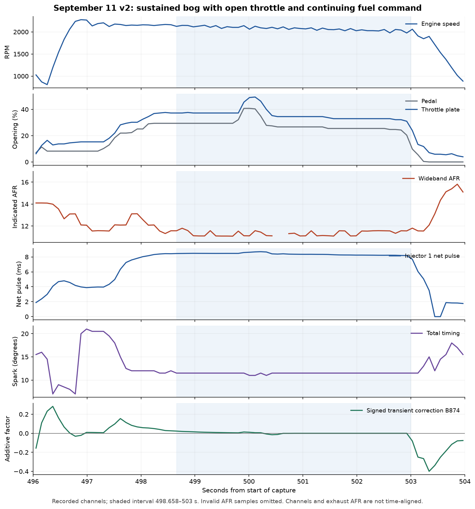

# September 11 v2 driving-bog review

The sustained bog is accompanied by an open throttle and continuing injector-1
pulse commands. The indicated AFR is predominantly rich, and the bog persists
after the signed transient correction settles near zero. This capture does not
establish a single physical cause. Adding more tip-in fuel is not supported by
the sustained portion of the event.

The newest warning-light component also contains a confirmed address/hook
mistake. Removing that component is justified independently of the bog; its
verified call route is through initialization, so it is not proven to explain
the driving symptom.

## Capture and flashed image

- Input: [romraiderlog_drive2_20260911_172841.csv](romraiderlog_drive2_20260911_172841.csv).
  SHA-256 `6716eb0715bea7b0e4a2431a677b4615d8bd343faff78574235376362f8dcf6f`.
- 5,821 complete samples, 19 channels, 605.384 seconds. Sample intervals are
  100/104/110 ms minimum/median/maximum. Original CSV unchanged.
- Current image: `master_patch_v2/D2WD610H_master_patch_v2.bin`, commit
  `ecba442`, SHA-256
  `5a9524896e7fabf504633233076108f46128e80c603884cb5c971bce08684370`.
- All 16 image-block CRCs match the recorded post-flash verification in
  `/Users/regan/.config/FastECU/0.1.0-beta.5/syslogs/log_fastecu_2026-09-11_17h09m54s.txt`.
  Verification ended about 17:12, before this capture. CRCs use FastECU's
  custom reflected polynomial `0x5AA5A55A`, not the standard zlib CRC.
- The user confirms the physical wideband display follows the log. This rules
  out a simple display/logger disagreement, not an error shared by the sensor
  and controller.
- Coolant rises from 23 to 60 C. These are not fully warm commissioning data.
  The engine stops/restarts around 299–301 seconds; whether this was intentional
  has not been established.

## Sustained event: approximately 499–503 seconds

| Time (s) | Pedal (%) | Plate (%) | RPM | MAP (kPa) | Load (g/rev) | Indicated AFR | Net pulse (ms) | Spark (deg) | B874 |
|---|---:|---:|---:|---:|---:|---:|---:|---:|---:|
| 499.699 | 29.41 | 37.25 | 2102 | 100 | 2.02 | 11.08 | 8.4720 | 11.5 | +0.0056 |
| 502.297 | 25.49 | 32.94 | 2028 | 98 | 1.97 | 11.57 | 8.2317 | 11.5 | 0.0000 |

Across 498.658–503.000 seconds, the 42 samples show 31–49% throttle plate,
97–103 kPa processed MAP, 1.95–2.07 g/rev load and 8.18–8.70 ms net pulse.
Forty samples have valid AFR, with median 11.325; two are invalid and excluded.
Transient correction has median zero and range −0.0150 to +0.0232.
There are no recorded zero injector-1 net-pulse samples anywhere in the capture
with pedal above 5% and RPM above 500. This does not exclude a shorter cut
between samples, another cylinder's state, or a physical delivery fault.

The current ROM's primary open-loop A and B tables both decode to approximately
11.357 AFR at the example loads and RPMs (raw 37, lambda `128/165`). This is a
conditional table lookup, not an independently logged final target. The measured
11.1–11.6 AFR is close to that rich command. Rich readings alone therefore do
not establish flooding or prove that VE is wrong.

At 502.297 seconds, the logged composed factor gives
`1.97 g/rev × 3.266667 ms/(g/rev) × 1.28 = 8.2372 ms`, close to the recorded
8.2317 ms. E123/B7DC is already composed; multiplying it by `1+B874` again
would double-count the transient contribution. E60/C0B8 is scheduled-count-derived
net pulse, excluding latency, not measured electrical injector on-time.

At that same point, all six base-timing table endpoints interpolate to about
7.50 degrees, and the KCA maximum endpoints to 3.89 degrees. Their sum is
consistent with the logged 11.5 degrees. This is not evidence of a measured
knock-retard event: IAM, FBKC, FLKC and the active selection state were not logged.

Battery voltage sometimes falls to about 12.5–12.8 V under pedal, but comparable
rich, sustained events also occur at 14.2–14.3 V. Voltage alone does not account
for the symptom. No vehicle speed, gear, fuel pressure, actual cam angles or
committed AVLS mode were recorded. P7 MAP is the processed channel, not the
direct ABC4 speed-density input.

## Confirmed newest-component defect and rollback scope

[`alert_strobe_component.py`](../master_patch_v2/alert_strobe_component.py)
labels `FFFFB134` as a MIL output and hooks literal `000067DC`, originally
pointing to `0000F710`. Ghidra MCP inspection and current-image literal decoding
show a different function:

1. `F710` checks the protected-RAM sentinel at `FFFF8000` against `AA55`.
2. It sets/reads byte `FFFFB134` as a validation/initialization flag.
3. Flag zero runs the validation chain through `CE0C` to `FD5C`.
4. Flag one writes the sentinel and calls `CE18 -> 6604 -> B536`, which
   initializes protected float records at `FFFF803C` and `FFFF8044`.
5. Later `F754` also reads this flag; flag one calls
   `CE12 -> 65FE -> 10690`, the protected-state initialization dispatcher.

The hook is reached through `6328:6396 -> 66B4:66B8 -> [67DC]`.
The existing scheduler audit identifies `6328` as task 17, activated by the
kernel's initial task list. Periodic lamp execution and the claimed strobe rate
have not been established. This is a real misuse of native state, but the
capture does not prove that it ran during the held-pedal bog.

Ghidra MCP disassembly comments at `F710` and `67DC` were updated; the `F710`
comment was read back. This records the discovery in the live project;
the connector does not provide an explicit project-save operation.

The immediate parent is **`3055603` — VE fine adjustment**. Its tracked image
SHA-256 is `5a1ad588dc620f6a4bb9ee3a464fa9eefc173cc107b8e5cc4a3c918a59004755`.
The only binary differences from the current image are the warning hook/blob,
initial IAM at `77FD8` (parent 0.5, current 1.0), and checksum repair. A rollback
to that revision preserves the preceding v2 MAP, load-filter, timing, VE and
AVCS changes. It removes the confirmed warning-component defect but is not
evidence that the older calibration is ready for driving.

The BIN present at `rollback/D2WD610H_master_patch_v2.bin` during this review
matches that parent image byte for byte. Both current and parent images pass
the native Subaru checksum calculation over descriptor range
`00002000..0007FAF7` (the final word starts at `0007FAF4`). The rollback file
was not created or modified by this review.

## Calibration-analysis defect to address before further VE edits

[`tools/analyze_log_ve.py`](../tools/analyze_log_ve.py) hardcodes axes that do not
match the current ROM. The actual low-lift RPM axis is
`0, 500, 800, 1200, 1600, 2000, 2500, 3000, 3200`; the helper instead uses
`400, 800, 1200, 1600, 2000, 2400, 2800, 3200, 3600`.
Its high-lift RPM axis and several higher-pressure MAP bins also disagree.
It infers AVLS from RPM, uses processed MAP in place of the native SD input,
and treats `14.64/B7DC` as an unqualified target AFR. Its sample filter does
not establish settled RPM/MAP or account for exhaust transport delay.

Consequently, its printed per-cell VE adjustments are not reliable calibration
instructions. This does not prove which historical edits used those outputs,
nor that their errors caused this bog. The next software work should remove
the incorrect warning hook and correct these analysis assumptions before
making additional fuel or timing changes. A remaining bog requires checking
actual fuel delivery, ignition and cam operation against their commands;
this log cannot distinguish those physical causes.

No patch source, ROM image or raw capture was changed, and no ECU action was
performed during this review.
