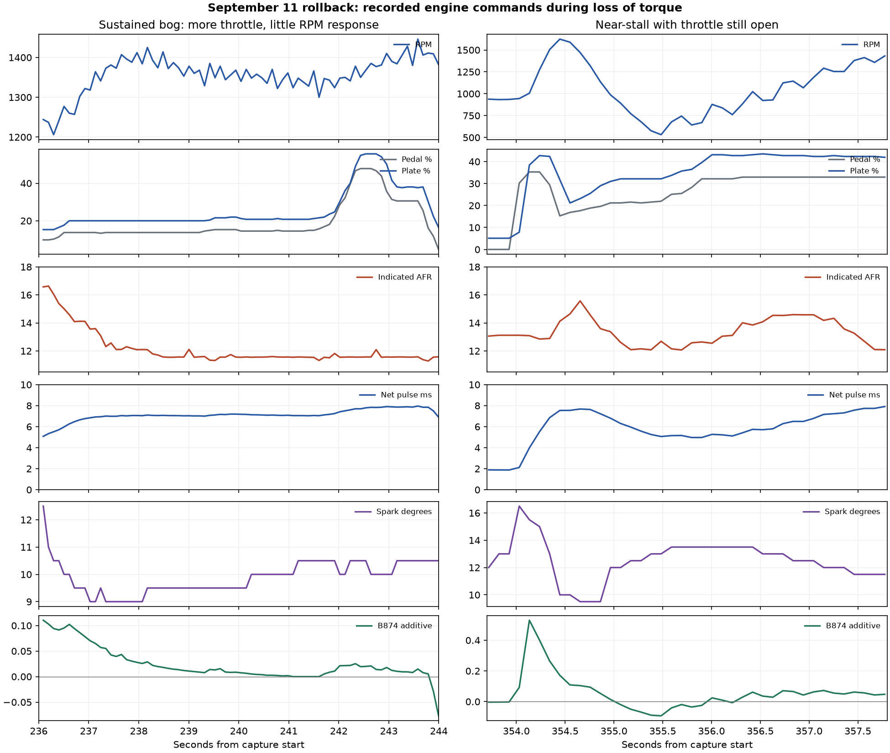

# September 11 rollback: loss of torque under load

The rollback did not resolve the reported driving problem. The user confirms
that neutral revs are normal, but the car has very little torque when moving
or climbing a slight hill. These September 11 drives are the first movement
under the car's own power since the turbo conversion; there is no established
driving baseline for this hardware.

The sustained measured AFR is close to the current ROM's requested mixture.
This argues against a gross steady-state fuel-delivery shortage. Fuel pressure
is an unverified commissioning input, not a demonstrated cause in this log.
Do not infer a need for more tip-in enrichment or a blanket VE change from
the reported loss of torque.

## Provenance

- Capture: `romraiderlog_rollbackdrive1\_20260911_180013.csv` (the filename
  contains a literal backslash). SHA-256
  `9ab91bcba3cf19aece029f817730be5080e7db292ac554f35597161daff77551`.
- 4,184 complete samples, 19 channels, 435.046 seconds; sample intervals
  101/104/107 ms minimum/median/maximum. Coolant 54–70 C.
- Flashed rollback: `3055603`, SHA-256
  `5a1ad588dc620f6a4bb9ee3a464fa9eefc173cc107b8e5cc4a3c918a59004755`.
- All 16 blocks match FastECU's recorded verification at 17:58:19–17:58:23,
  in the second post-flash section of
  `log_fastecu_2026-09-11_17h09m54s.txt`. The ROM's Subaru checksum also passes.
- This image contains the stock `67DC -> F710` literal and no warning strobe.
  Therefore the incorrect warning hook identified in the
  [earlier review](20260911_drive2_review.md) is not required for the bog.

## What happens under load

| Time (s) | Pedal (%) | Plate (%) | RPM | MAP (kPa) | Load (g/rev) | AFR | Net pulse (ms) | Spark (deg) | B874 | Battery (V) |
|---|---:|---:|---:|---:|---:|---:|---:|---:|---:|---:|
| 239.213 | 13.73 | 20.00 | 1368 | 86 | 1.66 | 11.58 | 7.0230 | 9.5 | +0.0088 | 14.24 |
| 242.852 | 43.92 | 54.12 | 1381 | 100 | 1.85 | 11.55 | 7.8475 | 10.0 | +0.0132 | 14.24 |
| 355.484 | 21.96 | 32.16 | 532 | 97 | 1.37 | 12.69 | 5.0617 | 13.0 | −0.0926 | 13.68 |

The first two rows illustrate the sustained problem: much more throttle and
higher manifold pressure produce little RPM response during the user's driving
attempt. AFR remains about 11.6, injector-1 fuel remains commanded, and the
transient contribution is small. Speed, gear and clutch position are absent;
the CSV cannot quantify wheel torque or independently establish drivetrain load.

The near-stall sequence falls from 1,624 RPM at 354.446 seconds to 532 RPM at
355.484 seconds, despite an open plate. At the lowest point, the transient
correction is about −9.3%, not the historical −53% value. The slow-transient
mechanism does not explain the separate sustained bog where B874 is near zero.

There are no recorded zero injector-1 net-pulse samples with pedal above 5%
and RPM above 500. This excludes a sustained cut in this recorded channel;
it does not measure injector electrical operation, all cylinders or sub-sample
cut events. The sustained problem also occurs with approximately 14.2 V battery
voltage, so the earlier 12.5–12.8 V periods are not necessary for it either.

## Fueling interpretation

Both primary open-loop tables decode to approximately 11.357 AFR at the first
two example loads and RPMs: raw 37, lambda `128/165`, using 14.64 stoichiometric
AFR. This conditional lookup agrees closely with the indicated 11.55–11.58.
The log therefore does not support a gross fuel shortage or an unexplained
rich fallback as the explanation for these sustained events.

An appropriate target and accurate delivery are separate questions. A target
can be deliberately rich, but an AFR near 11.5 alone does not establish the
cause of almost absent torque. There is no evidence here to prescribe a new
AFR target or ignition advance value.

AFR agreement also does not independently validate every fuel-model input.
For example, a VE adjustment can compensate for an injector-scaling error,
leaving delivered AFR correct while the modeled g/rev load used by ignition
and AVCS is wrong. This is a possible calibration interaction, not an identified
error in this capture. The earlier VE-analysis helper's wrong axes remain a
reason to check its methodology before using its recommendations.

Haltech's [VE tuning guidance](https://support.haltech.com/portal/en/kb/articles/tuning-base-tables)
likewise distinguishes injector characterization, VE and target AFR; errors in
the first can be absorbed into the VE table. Its recommendations describe general
tuning practice, not validation of this ECU or a prescribed EZ30R calibration.

## Ignition evidence and limits

The current low-RPM, high-load calibration explains much of the modest spark
command. Around 2,000 RPM and 1.6–2.0 g/rev, its base maps are approximately
7.42 degrees and KCA maxima approximately 3.87–4.22 degrees. KCA maxima are
not measured applied advance; actual IAM and knock corrections are missing.
Do not compare stock base tables alone against final logged spark: the stock
strategy uses substantial positive KCA in addition to base timing.

The P10 timing channel was traced through Ghidra MCP and the rollback bytes:
SSM index `11`, callback slot `4B740`, invokes `31684`, which reads the first
final per-cylinder command at `FFFFC0EC`. Its conversion helper produces the
byte decoded by the logger as `(x-128)/2`. Thus the displayed 9–11 degrees
is a software command for one cylinder, not measured crankshaft timing or a
complete six-cylinder ignition capture. The separate `4F1C4` logger converter
also reads C0EC. Ghidra comments record the verified P10 route.

There is a brief −2.5/−2.0-degree opening transient at 364.851/364.955 seconds,
but the sustained bog occurs elsewhere with positive timing. This short dip
does not explain the prolonged loss of torque.

Next priorities are to establish actual ignition timing and cylinder operation,
and commanded versus actual AVCS/AVLS behavior under controlled load. The current
capture lacks IAM, FBKC, FLKC, actual cam angles and committed AVLS state. A
timing or cam fault has not yet been demonstrated. A timing-light check compares
the ECU command against physical timing; controlled load and knock monitoring
are needed to judge calibration changes, as described in Haltech's
[base-table guidance](https://support.haltech.com/portal/en/kb/articles/tuning-base-tables)
and [load-tuning guidance](https://support.haltech.com/portal/en/kb/articles/applying-load).
The car's reported inability to climb a slight hill is a reason to pause road
tests, not to add advance or fuel by guesswork.

## Isolated pulse-channel anomalies

The raw capture includes 32.723 ms at 211.334 seconds and 2.050 ms at
358.088 seconds amid roughly 8 ms pulses. Their float byte patterns are
consistent with reading across an ECU update at the 8,192-microsecond boundary:

- `46 FF A6 00` decodes to 32,723 us; `45 FF A6 00` decodes to 8,180.75 us.
- `45 00 20 00` decodes to 2,050 us; `46 00 20 00` decodes to 8,200 us.

A retained old first byte plus a newer remaining three bytes can produce these
values. This is a read-coherence hypothesis, not proof of the exact unseen
intermediate values. The CSV remains unchanged. Do not identify these single
samples as physical 32 ms injections or cut pulses without corroboration.

Reproduce summaries and plots with
`tmp/v2_log_review/venv/bin/python tools/analysis/analyze_20260911_rollback.py --write`.
The [JSON](20260911_rollback_review.json) retains hashes, flash-block comparisons,
sample summaries, examples and limitations. No calibration, ROM or raw capture
was changed during this review, and no ECU action was performed.
