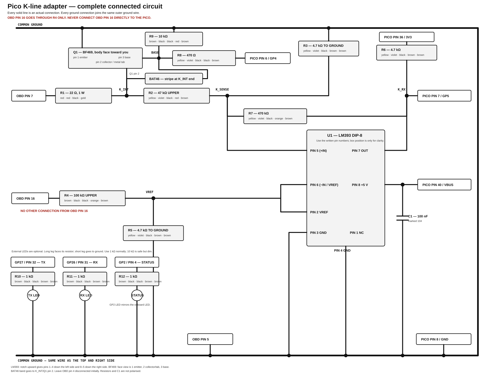

# Jaycar discrete fast K-line interface

Status: buildable revision-A schematic for the current Raspberry Pi Pico
firmware. This is the deliberately simple, fast version: it does not use a
dedicated K-line IC, an external K-line pull-up, or a discrete current limiter.

Commissioning update, 2026-09-07: the standalone circuit has not passed ECU
communication. The earlier AD310-era 11 V observation does not verify that
this circuit has sufficient K-line pull-up by itself. With firmware 1.1.2, TX
switches but RX samples low and no UART bytes are decoded during identity
requests. A missing/weak bus pull-up is under investigation alongside physical
faults. See [../TEST_RESULTS.md](../TEST_RESULTS.md); omission of the pull-up
must not be treated as a validated vehicle property.

### Temporary K-line pull-up test

The user has spare original-BOM resistors. For the next stationary diagnostic
test, add two 470 Ohm resistors in series (940 Ohm total), each rated 0.5 W
or greater, between raw OBD pin 16 and `K_INT`. `K_INT` is the BF469 middle
leg/collector/metal-tab node, on the circuit side of the 22 Ohm resistor.
The raw pin-16 connection is on the OBD side of R4 (100 kOhm), not the
R4/R5 comparator-reference junction. Neither end goes to a Pico supply pin.

```text
raw OBD16 --- 470 Ohm --- 470 Ohm --- K_INT / BF469 collector
```

Fit with USB and OBD disconnected. Retain the existing R4 reference branch
and all existing components. This is an explicit temporary exception to the
revision-A drawing's instruction that OBD16 connects only through R4; the
extra branch contains both series resistors. It is a diagnostic configuration,
not a claim that the circuit has passed communication or high-speed tests.

At 12 V, a fully low K_INT would draw at most approximately 12.8 mA through
this branch; each 470 Ohm resistor dissipates approximately 0.077 W. At 16 V,
each dissipates approximately 0.136 W. Use 470 Ohm, not 470 kOhm or 4.7 kOhm.
After connection, read the Pico's idle GP4/GP5 status before sending another
SSM identity request. If GP5 changes to high and echo starts working, that
supports insufficient idle bias as the fault; otherwise the fault remains
unisolated. Do not substitute a direct wire for this resistor chain.



Use the [physical wiring guide and connection checklist](JAYCAR_FAST_KLINE_WIRING.md)
for assembly. It draws the connected components, resistor colour bands, IC,
transistor, diode, OBD and Pico orientations directly.

The conventional [electrical schematic](JAYCAR_FAST_KLINE_SCHEMATIC.svg) is
retained for formal circuit review. Wire components by their named pins rather
than an assumed package orientation.

## Purpose and polarity

The circuit replaces the ANCEL AD310 analogue section with parts available
from Jaycar. It preserves the electrical polarity used by the current Pico
firmware:

- Pico `GP4` low or high-impedance: Q1 is off and K-line is released/high.
- Pico `GP4` high: Q1 is on and K-line is pulled low.
- LM393 output high: K-line is high.
- LM393 output low: K-line is low.

Keep `KLINE_TX_INVERTED` enabled in the firmware. The interface returns local
echo on `GP5`, as required by the current bridge design.

## Connections

| External connection | Circuit connection |
|---|---|
| OBD-II pin 7 | `K_CONNECTOR`, through R1 to `K_INT` |
| OBD-II pin 5 | Common signal ground |
| OBD-II pin 4 | Optional ground link; leave open initially |
| OBD-II pin 16 | R4 only, to create the battery-tracking receive threshold |
| Pico `GP4`, physical pin 6 | R8, then Q1 base |
| Pico `GP5`, physical pin 7 | U1 pin 7, `K_RX` |
| Pico `GND`, physical pin 8 | Common signal ground |
| Pico `3V3 OUT`, physical pin 36 | R6 receive-output pull-up |
| Pico `VBUS`, physical pin 40 | U1 pin 8, comparator 5 V supply |
| Pico `GP27`, physical pin 32 | R10, then TX LED anode |
| Pico `GP26`, physical pin 31 | R11, then RX LED anode |
| Pico `GP2`, physical pin 4 | R12, then status/error LED anode |

OBD pin 16 does not power the Pico. Its only connection is through 100 kOhm,
so do not add a direct pin-16-to-`VBUS`, `VSYS`, or `3V3` wire.

## Receive thresholds

R2/R3 scale K-line by approximately 11:1. R4/R5 generate a reference of
approximately 4.49% of battery voltage. Without hysteresis, the comparator
therefore changes state at approximately 49.4% of battery voltage.

R7 feeds back the 3.3 V comparator output and produces approximate K-line
thresholds of:

- rising: `0.498 x VBAT`;
- falling: `0.475 x VBAT`; and
- hysteresis: approximately 0.33 V measured at K-line.

At 14.0 V battery voltage, this is approximately 6.97 V rising and 6.65 V
falling. Do not add a capacitor to `K_SENSE`; the LM393 hysteresis supplies the
noise margin without slowing the receive edge.

## Complete Jaycar BOM

| Ref | Qty | Component | Jaycar catalogue number | Notes |
|---|---:|---|---|---|
| P1 | 1 | Raspberry Pi Pico / RP2040 | Existing part | USB powered |
| U1 | 1 | LM393 dual comparator, DIP-8 | `ZL3393` | Use an 8-pin socket if desired |
| Q1 | 1 | BF469 NPN transistor, TO-126 | `ZT2200` | Pins 1 E, 2 C/tab, 3 B |
| D2 | 1 | BAT46 Schottky diode | `ZR1141` | Baker clamp: anode B, cathode C |
| R1 | 1 | 22 Ohm, 1 W | `RR2534` | K-line series resistor |
| R2 | 1 | 47 kOhm, 0.5 W, 1% | `RR0612` | K receive divider, upper |
| R3 | 1 | 4.7 kOhm, 0.5 W, 1% | `RR0588` | K receive divider, lower |
| R4 | 1 | 100 kOhm, 0.5 W, 1% | `RR0620` | VBAT reference divider, upper |
| R5 | 1 | 4.7 kOhm, 0.5 W, 1% | `RR0588` | VBAT reference divider, lower |
| R6 | 1 | 4.7 kOhm, 0.5 W, 1% | `RR0588` | LM393 output pull-up to 3V3 |
| R7 | 1 | 470 kOhm, 0.5 W, 1% | `RR0636` | Receive hysteresis |
| R8 | 1 | 470 Ohm, 0.5 W, 1% | `RR0564` | Pico-to-Q1 base drive |
| R9 | 1 | 10 kOhm, 0.5 W, 1% | `RR0596` | Q1 base pull-down |
| C1 | 1 | 100 nF, at least 10 V | `RM7125` | Directly across U1 pins 8 and 4 |
| R10--R12 | 3 | 1 kOhm, 0.5 W, 1% | `RR0572` | Optional TX, RX and status LED resistors; 10 kOhm is safe but dim |
| D3--D5 | 3 | Ordinary LEDs | e.g. `ZD0150` | Optional; anodes via R10--R12, cathodes to ground |
| J1 | 1 | OBD cable/connector | Existing AD310 cable | Pins 7, 5, 16; pin 4 optional |
| D1 | 1 | 1.5KE36CA bidirectional TVS | `ZR1177` | Optional/DNP footprint only |
| U1 socket | 1 | DIP-8 IC socket | `PI6500` | Optional but convenient |
| PCB | 1 | Solderable prototyping board | `HP9570` | Do not use loose breadboard in car |

`DNP` means do not populate. D1 is shown as an optional footprint and is not
required for the first stationary test. No K-to-VBAT pull-up is fitted in
revision A. This was based on an approximately 11 V measurement during AD310
work; the standalone setup's loaded K-line idle voltage is still unverified.

Firmware LED meanings are: `GP27` flashes for transmit, `GP26` flashes for
receive (including local echo), and `GP2` mirrors the onboard status LED. The
status pair is solid when USB is not mounted, off when mounted and healthy, and
rapidly flashes after a recorded configuration, UART or buffer error.

## Critical package details

BF469 uses an unusual order compared with many other NPN transistors. The
published pin assignment is:

| BF469 pin | Function |
|---:|---|
| 1 | Emitter |
| 2 | Collector; also connected to the mounting tab |
| 3 | Base |

The BAT46 band marks its cathode. For D2, the banded end connects to Q1
collector and the unbanded end connects to Q1 base. This is a Baker clamp that
keeps Q1 out of deep saturation and improves its release edge.

## First electrical checks

1. With OBD disconnected and Pico on USB, confirm U1 pin 8 is about 5 V and
   U1 pin 7 is never above Pico 3.3 V.
2. Confirm Q1 is off with the Pico held in reset or disconnected from USB.
3. Connect OBD ground, pin 16 and pin 7 with ignition off, then switch ignition
   on. Before transmitting, confirm K-line is still approximately 11--14.5 V.
4. Confirm `VREF` is approximately `VBAT x 0.0449` and `K_SENSE` is
   approximately `K-line / 11`.
5. Transmit short test pulses. K-line should fall below approximately 2 V and
   return high cleanly; `GP5` should show the same bits as local echo.
6. Scope loopback at 4,800, 15,625 and 62,500 baud before using the circuit for
   ECU access.

The deliberately accepted failure case is a direct K-line-to-battery short
while Q1 is commanded on: Q1 may be destroyed. This revision prioritises a
small, fast, inexpensive interface. It must still pass repeatable full-ROM
reads before it is trusted for an ECU write.

## Component references

- [Jaycar LM393 (`ZL3393`)](https://www.jaycar.com.au/lm393-low-power-dual-comparator-linear-ic/p/ZL3393)
- [Jaycar BF469 (`ZT2200`)](https://www.jaycar.com.au/bf469-npn-transistor/p/ZT2200)
- [BF469 data sheet](https://media.jaycar.com.au/product/resources/ZT2200_datasheetMain_40249.pdf)
- [BAT46 data sheet](https://media.jaycar.com.au/product/resources/ZR1141_datasheetMain_40902.pdf)
