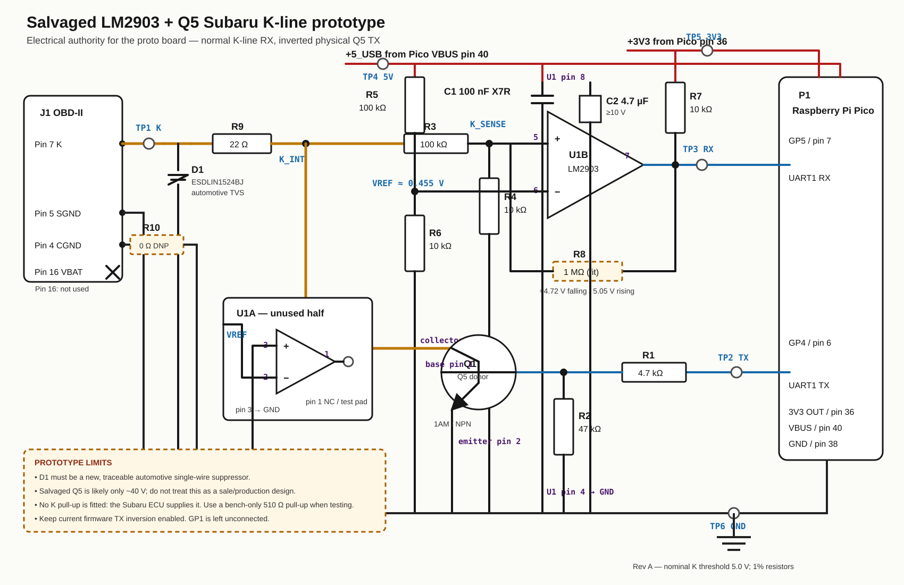

# Salvaged LM2903 + Q5 K-line prototype

Status: concrete hand-wired prototype circuit. It is intended to prove the
Pico transport and provide an expandable development board. It is **not** the
recommended production/sale circuit; use the protected L9637D design for that.



The SVG above is the electrical wiring authority for the prototype. It includes
reference designators, LM2903 pin numbers, Pico physical pins, test points, and
the connector protection omitted from the earlier physical concept render.

## U7 identification

U7 is an STMicroelectronics `LM2903` dual open-collector comparator in SO-8.
This identification is supported by both the visible `2903`/ST top marking and
the measurements already taken from the AD310:

| U7 pin | LM2903 function | AD310 measurement/observation |
|---:|---|---|
| 5 | comparator 2 non-inverting input | approximately K-line/battery voltage |
| 6 | comparator 2 inverting input | approximately 5 V threshold |
| 7 | comparator 2 open-collector output | approximately 5 V when K was idle |
| 8 | positive supply | approximately K-line/battery voltage |

Official top-view pinout:

| Pin | Function | Pin | Function |
|---:|---|---:|---|
| 1 | OUT1 | 8 | VCC+ |
| 2 | IN1- | 7 | OUT2 |
| 3 | IN1+ | 6 | IN2- |
| 4 | GND/VCC- | 5 | IN2+ |

Reference: [ST LM2903 data sheet](https://www.st.com/resource/en/datasheet/lm2903.pdf).

## Circuit

This version powers the comparator from Pico USB `VBUS` (nominal 5 V), divides
K-line before it reaches U7, and pulls its open-collector output up directly to
Pico `3V3`. It therefore does not need the AD310's 5 V regulator, original MCU,
protocol-selection network, or the existing 10 kOhm/10 kOhm Pico RX divider.

```text
                                  +5 V Pico VBUS
                                        |
                                       100k
                                        |
                     LM2903 pin 6 (IN2-)o---- 10k ---- GND
                               VREF = 5/11 V

 OBD pin 7 K -- D1 -- 22R -- K_INT -- 100k --+---- LM2903 pin 5 (IN2+)
 D1 to GND = ESDLIN1524BJ automotive TVS     |
                                               10k
                                                |
                                               GND

 Pico 3V3 ---- 10k ----+---- LM2903 pin 7 (OUT2) ---- Pico GP5 / UART RX
                       |
                       +---- 1M ---- LM2903 pin 5 (optional hysteresis)

 Pico VBUS 5V ---------------- LM2903 pin 8 (VCC+)
 Common GND ------------------ LM2903 pin 4 (VCC-)
 100 nF ceramic directly between pins 8 and 4

 Unused comparator:
 LM2903 pin 3 (IN1+) ---------- GND
 LM2903 pin 2 (IN1-) ---------- VREF at pin 6
 LM2903 pin 1 (OUT1) ---------- no connect/test pad


 Pico GP4 / UART TX ---- 4.7k ---- Q5 base (lower-left pad/pin 1)
                                      |
                                     47k
                                      |
                                     GND

 Q5 emitter (lower-right pad/pin 2) -------- GND
 Q5 collector (top pad/pin 3) -------------- K_INT after the 22 Ohm resistor

 OBD pin 5 signal ground ------------------- Common GND
 OBD pin 4 chassis ground ---- 0R/DNP ------- Common GND
```

The Q5 pin assignment shown is the standard SOT-23 `1AM`/MMBT3904-style
assignment and agrees with the successful AD310 connection. Confirm it with
diode-test measurements after removal, because `1AM` is a package marking, not
a guaranteed manufacturer part number.

## Why these values work

The K input divider is:

```text
VK_SENSE = VK * 10k / (100k + 10k) = VK / 11
```

The reference divider is:

```text
VREF = 5V * 10k / (100k + 10k) = 0.455 V
```

The comparator therefore changes state at approximately:

```text
VK = VREF * 11 = 5.0 V
```

With the optional 1 MOhm feedback resistor, the approximate thresholds become
4.72 V falling and 5.05 V rising. That small hysteresis prevents noise chatter
without materially delaying the K-line edge.

Expected states:

| K-line condition | Pin 5 | Pin 7 / Pico GP5 |
|---|---:|---:|
| Idle/high, 11--14.5 V | 1.0--1.32 V | High, approximately 3.3 V |
| Dominant/low, below 1 V | below 0.091 V | Low, normally below 0.3 V |

The 100 kOhm input resistor also limits current during abnormal K-line voltage,
but it is not a substitute for an automotive TVS at the connector.

## Complete prototype BOM

| Reference | Quantity | Component | Rating/package | Population |
|---|---:|---|---|---|
| P1 | 1 | Raspberry Pi Pico/RP2040 | Standard Pico module | Fit |
| J1 | 1 | AD310 OBD-II cable | Pins 7, 5 and optionally 4 used | Fit |
| U1 | 1 | ST LM2903 dual comparator | SO-8; salvaged AD310 U7 | Fit |
| Q1 | 1 | `1AM` NPN, verify pinout | SOT-23; salvaged AD310 Q5 | Fit for prototype only |
| D1 | 1 | ST ESDLIN1524BJ | SOD-323, AEC-Q101 single-wire TVS | Fit new part |
| R1 | 1 | 4.7 kOhm, 1% | 0603/0805; GP4-to-base | Fit |
| R2 | 1 | 47 kOhm, 1% | 0603/0805; base pull-down | Fit |
| R3 | 1 | 100 kOhm, 1% | 0603/0805; K-sense upper divider | Fit |
| R4 | 1 | 10 kOhm, 1% | 0603/0805; K-sense lower divider | Fit |
| R5 | 1 | 100 kOhm, 1% | 0603/0805; reference upper divider | Fit |
| R6 | 1 | 10 kOhm, 1% | 0603/0805; reference lower divider | Fit |
| R7 | 1 | 10 kOhm, 1% | 0603/0805; RX pull-up to Pico 3V3 | Fit |
| R8 | 1 | 1 MOhm, 1% | 0603/0805; receive hysteresis | Fit |
| R9 | 1 | 22 Ohm, 1% | 1206; K-line series limiter | Fit |
| R10 | 1 | 0 Ohm link | 0805; optional OBD pin-4 ground link | DNP initially |
| C1 | 1 | 100 nF X7R | At least 10 V; directly at U1 pins 8/4 | Fit |
| C2 | 1 | 4.7 uF ceramic/electrolytic | At least 10 V; local USB-5 V bulk | Fit |
| TP1--TP6 | 6 | Loop/pad test points | K, TX, RX, 5 V, 3V3 and GND | Fit |

`DNP` means do not populate. OBD pin 16 is deliberately left disconnected in
this USB-powered prototype. The vehicle supplies the K-line pull-up.

## Parts to salvage

| Quantity | Part | Source/marking |
|---:|---|---|
| 1 | LM2903 SO-8 comparator | AD310 U7 |
| 1 | NPN transistor | AD310 Q5, marked `1AM` |
| 1 | 4.7 kOhm | Existing proto TX resistor or part marked `472` |
| 1 | 47 kOhm | Part marked `473`; Q5 base pull-down |
| 2 | 100 kOhm | Parts marked `104` |
| 3 | 10 kOhm | Parts marked `103` |
| 1 | 1 MOhm, optional | Part marked `105` |
| 1 | 100 nF ceramic | Any sound local bypass capacitor |
| 1 | 4.7 uF, at least 10 V | USB 5 V local bulk capacitor |
| 1 | OBD cable | AD310 cable/connector |

New protection parts in the schematic:

| Reference | Part | Requirement |
|---|---|---|
| D1 | `ESDLIN1524BJ` | New, traceable AEC-Q101 single-wire automotive TVS |
| R9 | 22 Ohm, 1206 | One-percent preferred; K-line series/fault limiter |
| R10 | 0 Ohm, DNP by default | Optional chassis-ground link for OBD pin 4 |

Measure every resistor after removing one end from the donor circuit. In-circuit
readings are not reliable because the surrounding network creates parallel
paths.

## Protection that should not be scavenged blindly

For first current-limited, stationary tests, retain a replaceable fuse in the
OBD lead and add an automotive single-wire ESD suppressor at K. For a board that
will flash ECUs or be sold, use new traceable protection components and a
higher-voltage qualified K-line driver/transceiver.

The weak point of this cheap circuit is Q5: a typical `1AM` transistor is only
around a 40 V part, while vehicle transients can exceed that. The LM2903 input
is current-limited by 100 kOhm, but Q5's collector is directly exposed to K.
This is why the L9637D remains the production recommendation.

## Firmware compatibility

This circuit has the same transmit polarity as the current AD310/Q5 front end:

- Pico physical GP4 low: Q5 off, K-line recessive/high.
- Pico physical GP4 high: Q5 on, K-line dominant/low.

The current firmware's UART TX inversion must remain enabled. `GP1` can be left
unconnected; the firmware driving it low is harmless when no AD310 MCU exists.
GP5 receives normal, non-inverted UART levels from LM2903 pin 7.

## Assembly and test sequence

1. Mark U7 pin 1 before removing it, then clean and inspect every lead.
2. Build only the 5 V supply, decoupling, reference divider, and unused-input
   termination. Confirm pin 8 is 5 V and pin 6 is approximately 0.455 V.
3. Add the K divider. Use a current-limited bench supply in place of K and
   sweep 0--14 V; confirm pin 7 switches near 5 V.
4. Pull pin 7 up to Pico 3V3 and require less than 3.4 V at GP5 under every
   tested condition.
5. Add Q5, initially with a 1 kOhm resistor from a 12 V bench supply to the
   simulated K node. Confirm GP4 pulses pull K low and are echoed at GP5.
6. Scope the loopback at 4,800, 15,625, and 62,500 baud.
7. Confirm USB removal leaves Q5 off and the K node high.
8. Only after those checks, connect OBD pin 7 for a read-only ECU identity test.

Do not use the prototype for an ECU write until it produces repeatable,
byte-identical full ROM reads and passes the flashing qualification sequence in
[BOARD_PLAN.md](BOARD_PLAN.md).
