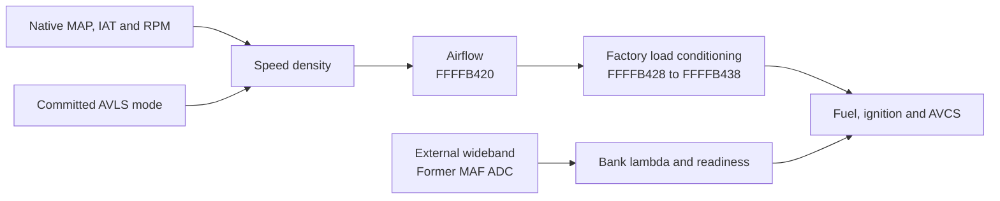

# D2WD610H EZ30R ECU Patches

Firmware patches, calibration tools and reverse engineering for a MAFless turbo
conversion of the Subaru EZ30R. The project integrates speed-density airflow,
external wideband feedback and additional fuel-cut protection into the factory
Denso ECU.

| Target | Specification |
|---|---|
| Vehicle | 2005 ADM Subaru Liberty 3.0R, manual transmission |
| ECU | Denso D2WD610H · ECU ID `3C5A387116` |
| Processor | Renesas SH7055SF · SH-2E · big-endian |
| Memory | 512 KiB flash · 32 KiB on-chip RAM |

[Technical reference](docs/reference/README.md) ·
[Memory ownership](master_patch/MEMORY_LAYOUT.md) ·
[Logger profiles](logger/README.md) ·
[Wiring](master_patch/WIRING.md)

## Patch set

The patches use the factory scheduler, electronic throttle control, injector
drivers, AVCS and radiator-fan control. New routines occupy checked erased
flash, with integration through specific task pointers, call sites and
calibration tables.

| Component | What it does |
|---|---|
| [Speed density](patches/speed_density/README.md) | Calculates airflow from native absolute MAP, RPM, IAT and displacement. Separate low- and high-lift VE tables follow committed AVLS state, and the result enters the factory load calculation. |
| [External wideband](patches/wideband_o2/wideband_component.py) | Uses the former MAF ADC input for wideband voltage and publishes lambda to both banks. The ongoing [process review](docs/reference/PATCH_PROCESS_FLOW.md#native-feedback-readiness-mismatch-and-phase-dependent-clearing) found a readiness mismatch that disables normal native bank feedback. |
| [Overboost protection](patches/core/patch_boost.py) | Adds a hard-overboost fuel cut alongside the stock rev limiter. Boost regulation uses the mechanical wastegate spring. |
| [Fueling protection](patches/fueling_safety/README.md) | Requests open loop near atmospheric pressure and adds a delayed, latched lean fuel cut under boost. Added cuts publish native injector inhibition under the scheduler lock. |
| [Purge removal](patches/purge_delete/purge_delete_component.py) | Zeros CPC purge duty, modeled purge airflow and both banks' purge fuel subtractions. |
| [Rotational idle](patches/core/ROTATIONAL_IDLE.md) | Optional per-cylinder idle retard retained in `master_patch/`, default off. Removed from `master_patch_v2/`; v2 calls the stock final-timing task directly. |
| [Integrated calibration](master_patch/CALIBRATION.md) | Supplies MAP/IAT transfers, injector characterization, load axes, fuel and timing tables, and the AVLS switching policy. |

## How the patches fit together



The speed-density helper supplies air mass in g/s. The retained ECU code
converts this to g/rev and conditions it before the fuel, timing and AVCS
lookups. The patch also updates the existing airflow-history channels so they
remain consistent with the modeled airflow. The local load-task hook keeps
the obsolete MAF-fault substitution from replacing this result.

Pressure/open-loop and fuel-cut wrappers run around the relevant native tasks.
Their decisions use the same native MAP and wideband signals. Detailed
producers, consumers and units are in the [signal reference](docs/reference/SIGNALS.md).

## RAM allocation

The SH7055SF RAM range is **`0xFFFF6000–0xFFFFDFFF` (32 KiB)**, with reset stack
pointer `0xFFFFDFA0`. Most storage belongs to the factory firmware; the patches
reuse identified signals and reclaim storage from replaced front-A/F processing.
Floats below are 32-bit, big-endian values.

### Persistent patch state

The lean-cut component reuses two four-byte front-A/F processing slots.
Its runtime fields occupy three bytes; initialization clears both complete
slots, so the allocation covers **eight bytes**.

| Reclaimed storage | Runtime field | Purpose |
|---|---|---|
| `0xFFFFAE9C–0xFFFFAE9F` | `uint16` at `0xFFFFAE9C` | Sensor transport-delay and lean-confirmation counter, measured in task calls. |
| `0xFFFFAEA0–0xFFFFAEA3` | `uint8` at `0xFFFFAEA0` | State: `0` idle, `1` delay, `2` monitoring, `3` cut latched. |

Installation requires the former front-A/F owner to be bypassed and preserves
the native AVCS current-feedback tasks and their float-1.0 initialization at
`0xFFFFC85C/0xFFFFC860`. The
[fueling-safety component](patches/fueling_safety/fueling_safety_component.py)
checks these prerequisites before claiming the storage. See the
[AVCS dependency repair](docs/reference/AVCS_OCV_REPAIR_20260913.md) for the
ownership trace and connected PWM tests.

### Existing factory storage used by the patches

These are shared native allocations, with the listed patch interfaces:

| Address | Storage | Role |
|---|---|---|
| `0xFFFFABC4` | Float, mmHg absolute | Native MAP input to speed density and pressure protection. |
| `0xFFFFAB06` | `uint16` ADC word | External wideband input on the former MAF circuit. |
| `0xFFFFB420` | Float, g/s | Final airflow published through the retained airflow task. |
| `0xFFFFB448`, `0xFFFFB458`, `0xFFFFB45C` | Three floats | Existing airflow state kept consistent with speed-density output. |
| `0xFFFFB428`, `0xFFFFB438` | Floats, g/rev | Raw and conditioned engine load produced by retained code. |
| `0xFFFFAE60`, `0xFFFFAE64` | Two floats | Synthetic bank lambda values. |
| `0xFFFFAE70`, `0xFFFFAE74` | Two floats | Synthetic bank sensor-readiness values. |
| `0xFFFFAE8C`, `0xFFFFAE90` | Two floats | Wideband lambda mirrors in replaced front-A/F storage. |
| `0xFFFFBF6C`, `0xFFFFB744` | `uint8` flags / `uint16` inhibit | Native fuel-cut flag and injector-inhibit publication. |
| `0xFFFFC0EC–0xFFFFC103` | Six floats, 24 bytes | Stock final per-cylinder ignition angles. The optional v1 rotational-idle component also uses these outputs. |
| `0xFFFFCD86` | `uint8` | Committed AVLS mode used to select the VE surface. |

Other inputs and purge-state destinations are listed in the
[complete signal reference](docs/reference/SIGNALS.md). Existing arrays,
initializers and computed accesses remain part of each allocation's ownership.

The speed-density wrapper uses a maximum 16-byte frame of its own; its traced
lookup call chain reaches 28 bytes beyond the caller's existing frame,
excluding interrupts. Total runtime stack headroom remains unmeasured.

## Flash allocation

The ROM occupies `0x00000000–0x0007FFFF`; file offsets equal ECU flash addresses.
The erased patch window starts at `0x0007D790`. Major component regions are:

| Region | Contents |
|---|---|
| `0x0007D790–0x0007D91F` | Overboost protection, architecture signature and retained reservations. |
| `0x0007DB40–0x0007DCFF` | Former rotational-idle reservation, erased in v2. v1 retains its calibration and wrapper through `0x0007DCEB`. |
| `0x0007DD00–0x0007E3FF` | Speed-density calibration, lookup descriptors and airflow wrapper reservation. |
| `0x0007E400–0x0007E63F` | Wideband conversion, closed-loop inhibit helper and reserved space. |
| `0x0007E640–0x0007EAC7` | Dual-VE descriptors, RPM axes and table data. |
| `0x0007EAC8–0x0007EDFF` | Pressure/open-loop and lean-cut calibration, wrappers and state initializer. |
| `0x0007EE00–0x0007FAF7` | **3,320 bytes of contiguous unallocated flash.** |

These grouped spans include internal padding and reservations. Stock hook and
calibration edits elsewhere have separate ownership. The
[detailed memory layout](master_patch/MEMORY_LAYOUT.md) records exact blob
boundaries, intentional overlaps and retired reservations. The Subaru additive
checksum covers `0x00002000–0x0007FAF7`, including the injected code.

## Build and verify

Each integration keeps its builder, calibration, ROM and ECU definition
together. Run the commands for the integration you are working on from the
repository root.

For `master_patch/`:

```sh
python3 -B master_patch/build_master_patch.py
python3 -B master_patch/build_definition.py
python3 -B tests/verify_master_patch.py
```

For `master_patch_v2/`:

```sh
python3 -B master_patch_v2/build_master_patch.py
python3 -B master_patch_v2/build_definition.py
python3 -B master_patch_v2/verify_master_patch.py
```

Builders start from pinned factory inputs, check original bytes before patching,
and write their normal output artifacts. Verification coverage, including
instruction execution, memory ownership, definitions and checksums, is described
in the [test guide](tests/README.md). Exact artifact identities are kept in the
[image reference](docs/reference/IMAGES.md).

Use the shared [logger definition and capture profiles](logger/README.md) with
either integration. The eight generated captures each use 43 byte addresses,
producing a 136-byte SSM request. Hardware assumptions and vehicle validation
procedures are documented in [calibration](master_patch/CALIBRATION.md),
[wiring](master_patch/WIRING.md) and [commissioning](master_patch/COMMISSIONING.md).

## Repository guide

| Location | Contents |
|---|---|
| [master_patch/](master_patch/README.md), [master_patch_v2/](master_patch_v2/) | Integrated builds, calibration sources, ROMs and ECU definitions. |
| [patches/](patches/README.md) | Shared firmware components and SH-2 assembly tools. |
| [logger/](logger/README.md) | RomRaider logger definitions and capture profiles. |
| [tests/](tests/README.md) | Offline verifiers and instruction-execution fixtures. |
| [tools/](tools/README.md) | Analysis, replay and documentation-audit utilities. |
| [docs/reference/](docs/reference/README.md) | Architecture, verified addresses, routine descriptions and Ghidra evidence. |
| [docs/hardware/](docs/hardware/README.md) | Hardware and direct-attach interface research. |
| [logs/](logs/README.md) | Captures and their analysis. |
| [base_roms/](base_roms/), [defs/](defs/) | Factory inputs and source ECU definitions. |
| [pico_kline_adapter/](pico_kline_adapter/README.md) | Independent K-line adapter project. |

The [address index](docs/reference/ADDRESS_INDEX.md) provides the detailed RAM
and routine register. Ghidra analysis status is documented
[here](docs/reference/GHIDRA.md); retained investigations are indexed in the
[documentation archive](docs/archive/README.md).
